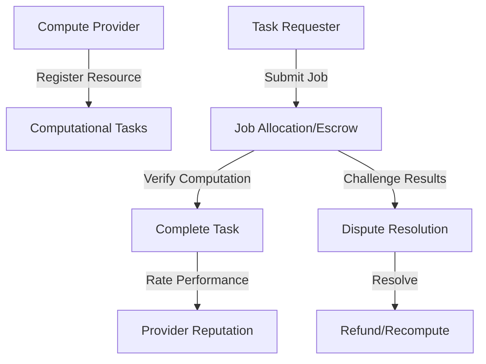

# Compile Apparatus - Decentralized Computation Marketplace

A trustless, decentralized platform for computational resource allocation built on the Stacks blockchain, enabling direct connections between computation providers and requesters.

## Overview

Compile Apparatus enables secure, decentralized computational resource allocation through smart contracts, featuring:

- Trustless job allocation and payment system
- On-chain computational task tracking
- Resource provider reputation mechanism
- Secure compute job execution
- Transparent task history and performance metrics

## Architecture

The platform is built around a central smart contract that manages computational tasks, job allocations, resource provisioning, and provider reputation systems.



### Core Components

1. **Task Management**: Tracks computational job specifications and requirements
2. **Resource Allocation**: Handles secure job assignment and payment
3. **Reputation System**: Maintains provider performance ratings
4. **Dispute Resolution**: Manages computation verification and conflict resolution

## Contract Documentation

### Main Contract: compute-broker.clar

The primary contract handling decentralized computational resource allocation.

#### Key Features:

- Product listing creation and management
- Purchase processing and escrow
- User reputation tracking
- Dispute resolution mechanism
- Transaction rating system

#### Access Control

- Sellers can only modify their own listings
- Buyers can only confirm their own purchases
- Dispute resolution requires contract-caller privileges
- Rating system restricted to transaction participants

## Getting Started

### Prerequisites

- Clarinet
- Stacks wallet
- STX tokens for transactions

### Basic Usage

#### Registering Computational Resources

```clarity
(contract-call? .compute-broker register-compute-resource
    "GPU"           ;; Resource Type
    u1000000        ;; Computational Power (FLOPS)
    u1000           ;; Price per Computation Unit
    (some "https://provider-endpoint.com")  ;; Resource Endpoint
    "Machine Learning"  ;; Specialization
)
```

#### Submitting a Computational Task

```clarity
(contract-call? .compute-broker submit-compute-task 
    u1               ;; resource-id
    "ML Training"    ;; Task Type
    u500000          ;; Computational Complexity
    u5000000         ;; Max Budget in microSTX
    "ipfs://task-details-hash"  ;; Task Specification
)
```

## Function Reference

### Listing Management

```clarity
(create-listing (title (string-ascii 100)) (description (string-utf8 1000)) (price uint) (image-url (optional (string-ascii 256))) (category (string-ascii 50)) (quantity uint))
(update-listing (listing-id uint) ...)
```

### Purchase Operations

```clarity
(purchase-item (listing-id uint) (quantity uint) (delivery-address (string-utf8 500)))
(confirm-receipt (purchase-id uint))
```

### Dispute Resolution

```clarity
(initiate-dispute (purchase-id uint) (reason (string-utf8 500)))
(resolve-dispute-refund (purchase-id uint))
(resolve-dispute-release (purchase-id uint))
```

### Reputation System

```clarity
(rate-seller (purchase-id uint) (rating uint) (comment (optional (string-utf8 500))))
(rate-buyer (purchase-id uint) (rating uint) (comment (optional (string-utf8 500))))
```

## Development

### Testing

1. Clone the repository
2. Install Clarinet
3. Run tests:
```bash
clarinet test
```

### Local Development

1. Start Clarinet console:
```bash
clarinet console
```

2. Deploy contracts:
```bash
clarinet deploy
```

## Security Considerations

### Limitations

- Dispute resolution mechanism requires trusted arbitrator
- Rating system vulnerable to Sybil attacks
- Fixed dispute resolution period

### Best Practices

1. Always verify transaction status before finalizing
2. Wait for sufficient block confirmations
3. Review listing details thoroughly before purchase
4. Keep delivery addresses encrypted off-chain
5. Monitor dispute timeframes carefully